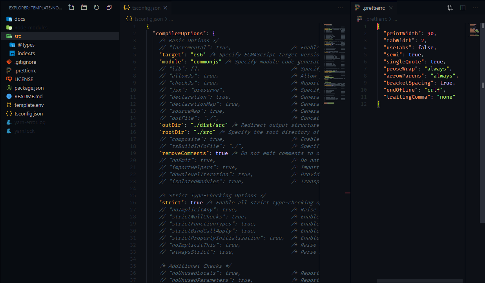

# template-node-ts

[](https://linkedin.com/in/edixonalberto)
[](./LICENSE.md)


Basic template to start a project using nodejs with typescript

### Comands
```sh
yarn install

yarn run dev # run app in mode developer
yarn run build # build app
yarn start # run app in mode production
```

### Screenshots


